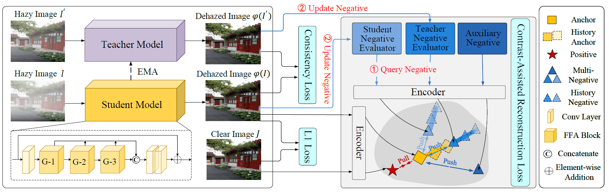

# Progressive Negative Enhancing Contrastive Learning for Image Dehazing and Beyond

## Network Architecture


## Dependencies
- Python >= 3.6
- PyTorch >= 1.0
- NVIDIA GPU+CUDA

## Introduction
- **train.py** and **test.py** are the entry codes for training and testing, respectively.
- **./DataLoader/dataloader.py** is used to load the training and testing data.
- **./Utils/metrics.py** contains image quality evaluation metrics, i.e., PSNR and SSIM.
- **./Utils/option.py** contains all the options.
- **./Utils/utils.py** provides all the required utilities.
- **./Models/backbone.py** defines the configurations of our proposed model.
- **./Losses/ContrastLoss.py** defines the contrastive loss.

## Quick Start
### Train
```
python train.py
```
### Test
```
python test.py
```
